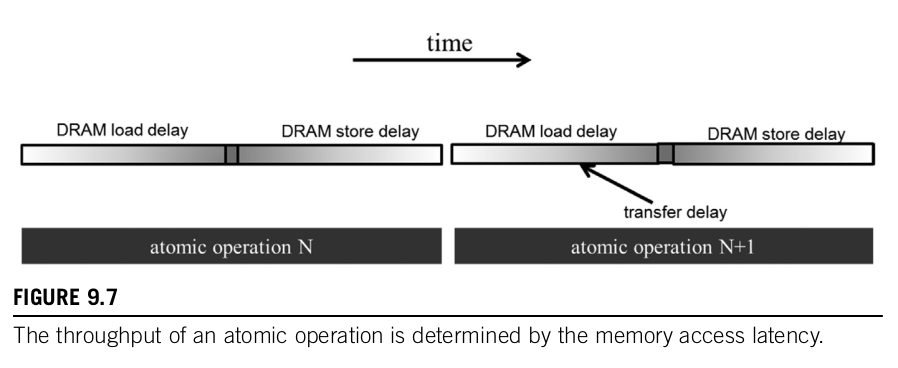
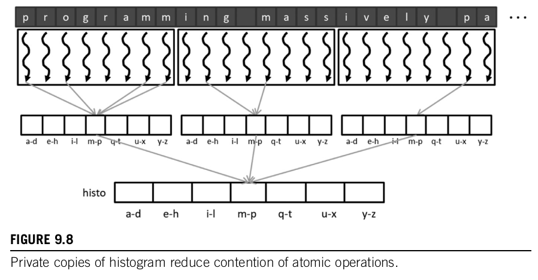
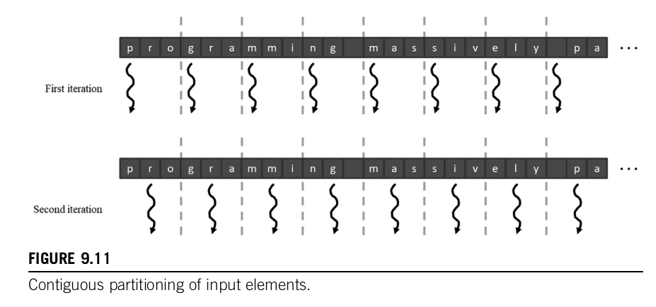
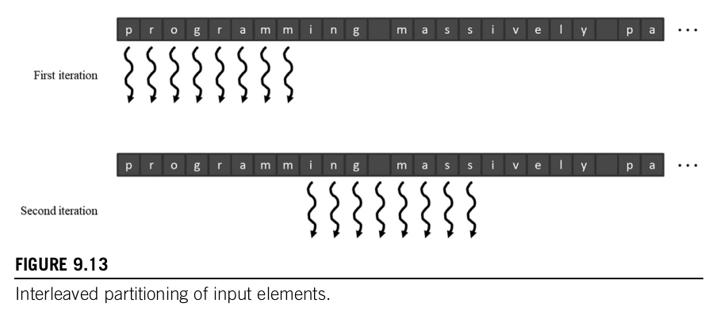

### Latency and throughput of atomic operations

The duration of each atomic operation is approximately the latency of a memory load (left section of the atomic operation time) plus the latency of a memory store (right section of the atomic operation time). The length of these time sections of each read-modify-write operation, usually hundreds of clock cycles, defines the minimum amount of time that must be dedicated to servicing each atomic operation and limits the throughput, or the rate at which atomic operations can be performed.

The duration of each atomic operation is approximately the latency of a memory load (left section of the atomic operation time) plus the latency of a memory store (right section of the atomic operation time). The length of these time sections of each read-modify-write operation, usually hundreds of clock cycles, defines the minimum amount of time that must be dedicated to servicing each atomic operation and limits the throughput, or the rate at which atomic operations can be performed.

For example, assume a memory system with a 64-bit (8-byte) double data rate DRAM interface per channel, eight channels, 1 GHz clock frequency, and typical access latency of 200 cycles. The peak access throughput of the memory system is 8 (bytes/transfer) * 2 (transfers per clock per channel) * 1G (clocks per second) * 8 (channels) = 128 GB/s. Assuming that each data accessed is 4 bytes, the system has a peak access throughput of 32G data elements per second.

>[!note]
>One approach to improving the throughput of atomic operations is to reduce the access latency to the heavily contended locations. Cache memories are the primary tool for reducing memory access latency. For this reason, modern GPUs allow atomic operations to be performed in the last-level cache, which is shared among all streaming multiprocessors (SMs). During an atomic operation, if the updated variable is found in the last-level cache, it is updated in the cache. 
>
>If it cannot be found in the last-level cache, it triggers a cache miss and is brought into the cache, where it is updated. Since the variables that are updated by atomic operations tend to be heavily accessed by many threads, these variables tend to remain in the cache once they have been brought in from DRAM. Because the access time to the last-level cache is in tens of cycles rather than hundreds of cycles, the throughput of atomic operations is improved by at least an order of magnitude compared to early generations of GPU. **This is an important reason why most modern GPUs support atomic operations in the last-level cache**.

### Privatization

The idea is to replicate highly contended output data structures into private copies so that each subset of threads can update its private copy. The benefit is that the private copies can be accessed with much less contention and often at much lower latency. These private copies can dramatically increase the throughput for updating the data structures. 

>[!note]
The downside is that the private copies need to be merged into the original data structure after the computation completes. One must carefully balance between the level of contention and the merging cost. Therefore in massively parallel systems, privatization is typically done for subsets of threads rather than individual threads.

### Privatization and SM

Another benefit of creating a private copy of the histogram on a per-thread-block basis is that if the number of bins in the histogram is small enough, the private copy of the histogram can be declared in shared memory. Using shared memory would not be possible if the private copy were accessed by multiple blocks because blocks do not have visibility of each other’s shared memory.

### Privatization and Coarsening

We saw that privatization reduces the number of atomic operations and storing the private copies in shared memory reduces the latency of each atomic operation. 

However the overhead lies in having to commit the values of the copies to the public copy (the more private copies we have the more we have to commit to the public copy). **But** if the number of thread blocks exceeds the number that can be executed simultaneously then the privatization overhead is paid unnecessarily. 

We can reduce this overhead of privatization by thread coarsening as we did before. In other words we reduce the number of private copies (and the number of commits to the public copy)

#### Contiguous partitioning

**Advantage of Contiguous partitioning in CPU threads**

- Since in CPUs the number of threads is a lot smaller than GPus, contiguous partitioning is the best-performing strategy since the sequential access pattern makes good use of cache lines. For example, in first iteration of the loop since the memory access happens in bursts it is guaranteed that the data will be available in the cache in the next iteration as well.

**Disadvantage of Contiguous partitioning in GPU threads**

- On the contrary, since GPUs invole so many more threads than CPUs, the large number of simultaneous accesses cause so much interference in the cache that one cannot expect the data to remain in the cache for the next iteration.

#### Interleaved partitioning

With interleaved partitioning, we leverage memory coalescing and all the elements will be fetched with only one DRAM access.

>[!note]
There are also more subtle performance considerations. For example, each thread should process four characters (a 32-bit word) in each iteration to fully utilize the interconnect bandwidth between the caches and the SMs.

### Aggregation

Some datasets have a large concentration of identical data values in localized areas. Such a high concentration of identical values causes heavy contention (multiple atomic operations happen in the same place) and reduced throughput of parallel histogram computation.

For such datasets a simple and yet effective optimization is for each thread to aggregate consecutive updates into a single update if they are updating the same element of the histogram. Such aggregation reduces the number of atomic operations to the highly contended histogram elements, thus improving the effective throughput of the computation.

>[!note] 
If the contention rate is low, an aggregated kernel may execute at lower speed than the simple kernel. However, if the data distribution leads to heavy contention in atomic operation execution, aggregation may result in significantly higher speed. 
>
>The added if-statement can potentially exhibit control divergence. However, if there is either no contention or heavy contention, there will be little control divergence, since the threads would either all be flushing the accumulator value or all be in a streak. In the case in which some threads will be in a streak and some will be flushing out their accumulator values, the control divergence is likely to be compensated by the reduced contention.