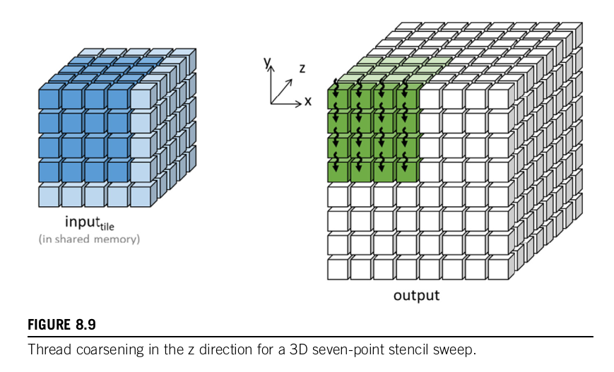
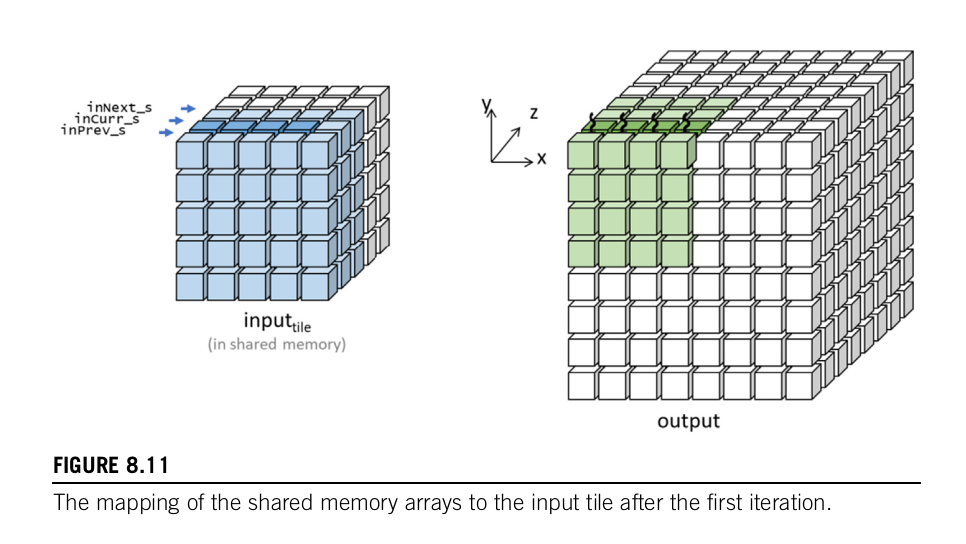

## Disadvantages on the small number of T

There are **two major disadvantages** *to the small limit on the* $T$ value that is imposed by the hardware. *The first disadvantage is that it limits the reuse ratio and thus the compute to memory access ratio*. For $T = 8$ the ratio for a seven-point stencil is only $1.37$ OP/B (asymptotic bound), which is much less than the upper bound of $3.25$ OP/B. The reuse ratio decreases as the $T$ value decreases because of the halo overhead.

*The second disadvantage of a small tile size is that it has an adverse impact on memory coalescing*. For an $8 \times 8 \times 8$, every warp that consists of $32$ threads will be responsible for loading four different rows of the tile that have eight input values each. 

Hence on the same load instruction the threads of the warp will access at least four distant locations in global memory. These accesses cannot be coalesced and will underutilize the DRAM bandwidth. Therefore $T$ needs to be a much larger value for the reuse level to be closer to $3.25$ OP/B and to enable full use of the DRAM bandwidth. The need for a larger $T$ motivates the approach that we will cover in the following section.

## Thread coarsening

As we have already said, the price of using multiple threads is paid for accessing more parallelism. In this case that price is paid in vain because there are multiple halo elements and for an input grid of $T$ values we can only calculate (for a 3D stencil) only $Τ-2$ output values. Supposing $T=8$ that means for an input tile of $8 \times 8 \times 8 = 512$ threads we can only calculate $(T-2)^{3} = 6^{3} = 216$ output points hence we are loading much more elements than the ones we are calculating outputs for.

As the number $T$ increases, the more output points we can calculate but we have a limit of $512$ threads so $T$ can only reach $T=10$ and we can imagine that for bigger stencils $T$ decreases dramatically (example: 3D $3$ points stencil needs $3$ points at each direction).

In order to avoid paying the price of using multiple threads in vain (low data reuse), we can leverage thread coarsening and hence each thread will be responsible for calculating multiple output points. In that way, we decrease the number of threads that we need for a stencil and we can possibly calculate stencils of bigger order while at the same time limiting the number of threads in a block to under $1024$.

## Register tiling

In stencils, there are interesting patterns that occur and we can do even more optimizations. For example, we can observe that at each iteration along with $z$ axis the elements at $(x, y, z-1)$, and $(x,y,z+1)$ and only the current $(x,y,z)$ is used by multiple threads and truly need to be in shared memory. That brings us to the last optimization which is to use 3 more registers `inPrev`, `inCurr` and `inNext` at each iteration along the $z$ axis.

### Advantages

1) Reads from and writes to the shared memory are now shifted into registers. Since registers have significantly lower latency and higher bandwidth than the shared memory, we expect the code to run faster. 

2) Each block consumes only one-third of the shared memory. This is, of course, achieved at the cost of three more registers used by each thread, or $3072$ more registers per block, assuming $32 \times 32$ blocks.

>[!note]
As the order of the stencil increases, the number of register increases as well. So we should keep in mind the number of registers and if that becomes a problem we can go back to store some elements in shared memory.

